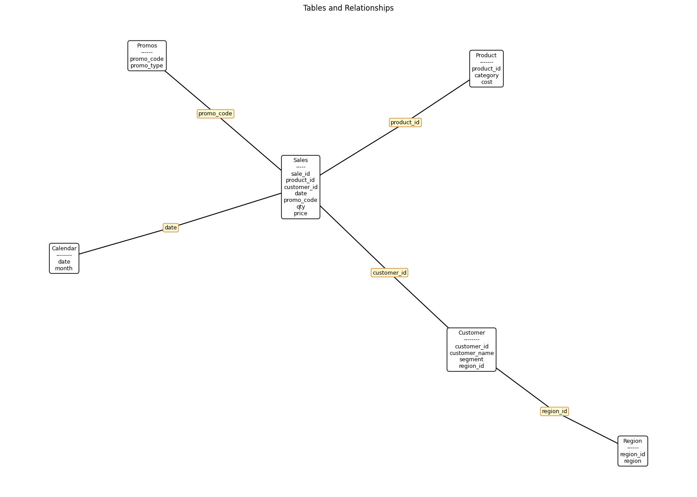

<p align="center">
  
</p>

<h1 align="center">Cube Alchemy</h1>

A lightweight hypercube engine for multidimensional analytics on top of pandas.

## Why It Matters

Reduce glue code and speed up your analysis so you can focus on insights.

- **Speed**: Automatic relationship discovery and traversal.

- **Simplicity**: Declarative queries achieve slicing and dicing in pure Python with less ad‑hoc joins.

- **Consistency**: Define your queries and use them everywhere with the same logic and filtering behavior.

- **Maintainability**: Centralized analytical logic in reusable components.

- **Integration**: Power fully interactive analytics apps using frameworks like Streamlit or Panel, or expose it to a web client.

## Installation
Requires Python 3.8+.

[](https://pypi.org/project/cube-alchemy/)

```bash
cd 'your_new_project_path'
python -m venv venv
venv\Scripts\activate
pip install cube-alchemy
```

## Basic usage

Transform your collection of pandas DataFrames into a cohesive analytical model in three simple steps:

- Connect your data - Add your pandas DataFrames to a Hypercube (relationships will be created automatically).

- Define your metrics, queries and plots.

- Query with ease - Extract insights.

```mermaid
flowchart LR

  subgraph S1["Connect Data"]
    A1["Load Data"] --> A2["Build Hypercube"]
  end

  subgraph S2["Specifications"]
    B1["Define Metrics"] --> B2["Define Queries"] --> B3["Define Plots"]
  end

  subgraph S3["Visualize and Interact"]
    C1["Execute Queries"] --> C2["Display"]
    C2 --> C3["Filter"]
    C3 --> C1
  end

  A2 --> B1
  B3 --> C1
```

Cube Alchemy connects your data by identifying common column names between DataFrames. These shared columns form the relationships; automatically building bridges between tables. The result is a unified schema you can slice and dice and query in a declarative, simple and intuetive way.

```python
import pandas as pd
from cube_alchemy import Hypercube

# 1) Define DataFrames (nodes)
products = pd.DataFrame({
    'product_id': [1, 2, 3],
    'category': ['Electronics', 'Home', 'Other'],
    'cost': [300.0, 15.0, 500.0],
})

customers = pd.DataFrame({
    'customer_id': [100, 101, 102, 103],
    'customer_name': ['Acme Co', 'Globex', 'Initech', 'Umbrella'],  
    'segment': ['SMB', 'Enterprise', 'SMB', 'Consumer'],
    'region_id': [7, 8, 7, 9],  
})

regions = pd.DataFrame({
    'region_id': [7, 8, 9],
    'region': ['North', 'West', 'South'],
})

calendar = pd.DataFrame({
    'date': ['2024-01-01', '2024-01-02', '2024-01-03', '2024-01-04', '2024-01-05'],  
    'month': ['2024-01', '2024-01', '2024-01', '2024-01', '2024-01'],
})

sales = pd.DataFrame({
    'sale_id': [10, 11, 12, 13, 14, 15],
    'product_id': [1, 1, 2, 3, 2, 1],                        
    'customer_id': [100, 101, 102, 103, 100, 102],           
    'date': ['2024-01-01', '2024-01-02', '2024-01-03', '2024-01-04', '2024-01-05', '2024-01-03'],  
    'promo_code': ['NEW10', 'NONE', 'DISC5', 'NONE', 'DISC5', 'NEW10'],  
    'qty': [2, 1, 4, 3, 5, 2],
    'price': [500.0, 500.0, 25.0, 800.0, 25.0, 500.0],
})

promos = pd.DataFrame({
    'promo_code': ['NEW10', 'DISC5', 'NONE'],
    'promo_type': ['Launch', 'Discount', 'No Promo'],
})

# 2) Build the hypercube
cube = Hypercube({
    'Product': products,
    'Customer': customers,
    'Region': regions,
    'Calendar': calendar,
    'Sales': sales,
    'Promos': promos,
})

# Inspect your new hypercube model (shared columns will connect tables)

cube.visualize_graph(full_column_names=False)
```



```python
# Define (can be done in YAML, here we expose the direct method)

# 3) Define metrics
cube.define_metric(
    name='Revenue',
    expression='[qty] * [price]',
    aggregation='sum'
)

cube.define_metric(
    name='Units',
    expression='[qty]',
    aggregation='sum'
)

cube.define_metric(
    name='Margin',
    expression='([price] - [cost]) * [qty]',
    aggregation='sum'
)

cube.define_metric(
    name='Number of Sales',
    expression='[sale_id]',
    aggregation='count'
)

# 4) Define query/ies
cube.define_query(
    name="sales analysis",
    dimensions={'region', 'category', 'promo_type'},
    metrics=['Revenue', 'Units', 'Margin', 'Number of Sales']
)

# 5) Execute the query (or queries)
cube.query("sales analysis")
```

**Output:**
```
   region     category promo_type  Revenue  Units  Margin  Number of Sales
0  North  Electronics     Launch   2000.0      4   800.0                2
1  North         Home   Discount    225.0      9    90.0                2
2  South        Other   No Promo   2400.0      3   900.0                1
3   West  Electronics   No Promo    500.0      1   200.0                1
```

```python
# 6) Apply a filter and query again
cube.filter({'customer_name': ['Initech']})     
cube.query("sales analysis")
```

**Output:**
```
   region     category promo_type  Revenue  Units  Margin  Number of Sales
0  North  Electronics     Launch   1000.0      2   400.0                1
1  North         Home   Discount    100.0      4    40.0                1
```

Additional features such as filters, custom context states, nested metrics, and plotting integrations are available but omitted here for brevity. See the docs for details.

## Full documentation
For concepts, API specs, advanced features, full examples and Streamlit integration see:

- Docs: https://cube-alchemy.info

## Examples and Demos

Explore our collection of practical examples and interactive demos to see Cube Alchemy in action:

### Jupyter Notebooks
- **Adventure Works Sales Analysis**: Explore a comprehensive retail dataset with drill-down capabilities
- **Financial P&L Modeling**: See how Cube Alchemy handles complex financial data modeling challenges

### Interactive Streamlit Applications
- **[Financial Performance Dashboard](https://cube-alchemy-examples-profit-and-loss.streamlit.app/overview)**: Explore a comprehensive P&L analysis tool with interactive filters and visualizations
- **[P&L Builder](https://cube-alchemy-examples-profit-and-loss-builder.streamlit.app/)**: Interactively construct and visualize financial models
- **[Data Explorer Playground](https://cube-alchemy-examples-emepzeemy9ayt7khx98fyo.streamlit.app/)**: Experiment with different chart types and visualization options

All examples are available in our [examples repository](https://github.com/cube-alchemy/cube-alchemy-examples).

## Creator

Created with 🧠 and ☕ by Juan C. Del Monte

<p align="center">
  <a href="https://www.linkedin.com/in/juandelmonte/" target="_blank">
    
  </a>
  <a href="mailto:delmontejuan92@gmail.com" target="_blank">
    
  </a>
  <a href="https://github.com/juandelmonte" target="_blank">
    
  </a>
</p>
<p align="center">
  <a href="https://www.cube-alchemy.com/" target="_blank">
    
  </a>
</p>
