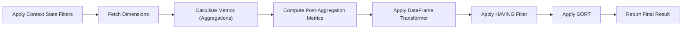

# Understanding Queries

Queries in Cube Alchemy bring together metrics and dimensions to answer specific questions.

A query consists of three key components:

- **Query name**: A unique identifier for referencing the query

- **Dimensions**: Columns to group by (the "by what" in your analysis)

- **Metrics**: Measures to calculate (the "what" in your analysis)

```python
# Define metrics
cube.define_metric(name='Revenue', expression='[qty] * [price]', aggregation='sum')
cube.define_metric(name='Order Count', expression='[order_id]', aggregation='count')

# Define a query by region and product category
cube.define_query(
    name="regional_sales",
    dimensions={'region', 'category'},
    metrics=['Revenue', 'Order Count']
)

# Execute the query
result = cube.query("regional_sales")
```

### Execution Pipeline

When you run a query, Cube Alchemy processes your data in a clear, ordered pipeline:



## Query Types

Queries must contain either dimensions, metrics, or both (a query cannot lack both).

### Dimension-Only Queries

When you only need to see what unique dimension combinations:

```python
# Define a query with only dimensions
cube.define_query(
    name="dimension_combinations",
    dimensions={'region', 'category'}
)

# Get all unique region/category combinations
combinations = cube.query("dimension_combinations")
```

### Metric-Only Queries

When you need to calculate global aggregates:

```python
# Define metrics
cube.define_metric(name='Total Revenue', expression='[qty] * [price]', aggregation='sum')
cube.define_metric(name='Total Orders', expression='[order_id]', aggregation='count')

# Define a query with no dimensions
cube.define_query(
    name="global_totals",
    metrics=['Total Revenue', 'Total Orders']
)

# Execute the query
global_results = cube.query("global_totals")
```

## Derived Metrics and HAVING

Derived metrics are calculated after base metrics are aggregated. Define them once, then reference by name in queries.

```python
# Define base metrics
cube.define_metric(name='Cost',   expression='[cost]',           aggregation='sum')
cube.define_metric(name='Margin', expression='[qty] * [price] - [cost]', aggregation='sum')

# Define a derived metric (post-aggregation)
cube.define_derived_metric(
    name='Margin %',
    expression='[Margin] / [Cost] * 100',
    fillna=0
)

# Use derived metric by name and add a HAVING filter
cube.define_query(
    name='margin_by_product',
    dimensions={'product'},
    metrics=['Margin', 'Cost'],
    derived_metrics=['Margin %'],
    having='[Margin %] >= 20'
)

df = cube.query('margin_by_product')
```

Notes:

- Use [Column] syntax in expressions; registered functions are available as @name.

- Derived metrics reference columns present in the aggregated result (metrics and dimensions).

### Effective dimensions

Effective dimensions are the dimensions that actually determine how a metric is aggregated. They are derived from the query’s dimensions after applying the metric’s `ignore_dimensions` setting:

- `ignore_dimensions=False` (default): effective dimensions = query dimensions.

- `ignore_dimensions` is a list: effective dimensions = query dimensions minus those listed.

- `ignore_dimensions=True`: no effective dimensions (grand total).

Nested metrics use the same effective dimensions in both inner and outer steps; `nested.dimensions` are added only for the inner step.

## Nested aggregation (inner → outer)

Use `nested` on a metric to aggregate in two steps: first by `nested.dimensions` (inner), then at the query dimensions (outer).

- Inner: aggregate the metric by the effective dimensions plus `nested.dimensions`.

- Outer: aggregate those inner results by the effective dimensions. If you display extra dimensions, results are broadcast to them.

Note: `ignore_dimensions` sets the metric’s effective dimensions and applies to both steps so results stay unbiased and consistent.

Minimal example:

```python
cube.define_metric(
    name='Avg Product Revenue',
    expression='[qty] * [price]',
    aggregation='mean',
    nested={'dimensions': 'Product', 'aggregation': 'sum'},
    ignore_dimensions=['Store']  # compute at Country-level; broadcast when displaying Store
)
```

## Working with Filters

Queries automatically respect all active filters on your hypercube, allowing you to:

1. Define a query once

2. Apply different filters

3. Execute the same query to see different filtered views of your data

```python
# Define your query
cube.define_query(
    name="product_sales",
    dimensions={'region', 'product_category'},
    metrics=['Revenue', 'Order Count']
)

# Get unfiltered results
unfiltered_results = cube.query("product_sales")

# Apply filters
cube.filter({'product_type': ['Electronics', 'Home']})

# Get filtered results using the same query
filtered_results = cube.query("product_sales")
```
