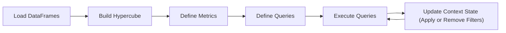

Cube Alchemy's workflow is intuitive and powerful: load your data, build a unified hypercube structure, define your metrics, and create reusable queries. The stateful architecture allows you to execute queries and apply filters in an iterative process, maintaining context throughout your analysis journey.