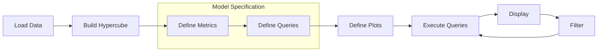

Cube Alchemy's workflow: load your data, build a unified hypercube, specify your model (metrics and queries), define plots, then execute. The stateful architecture lets you iterate by applying filters and re-running queries and plots.